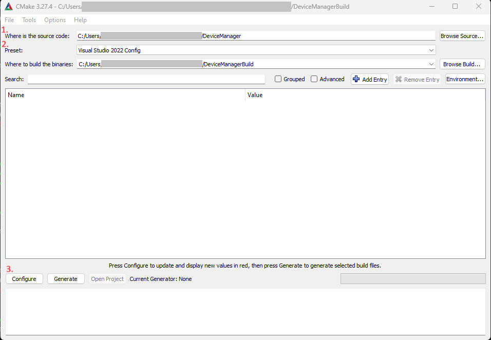
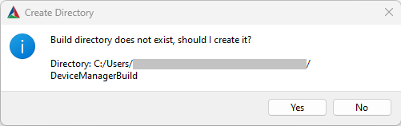
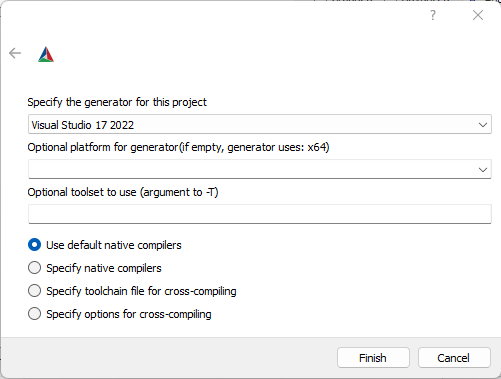
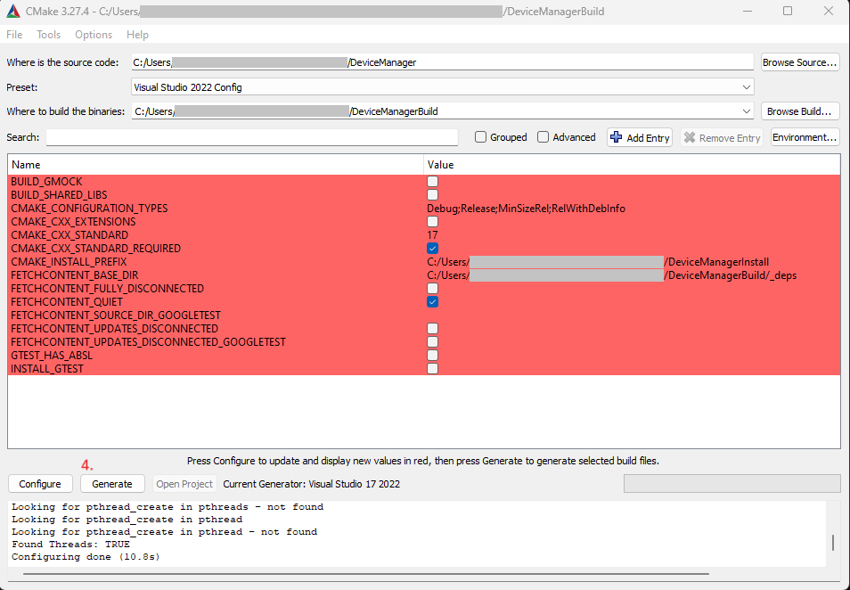
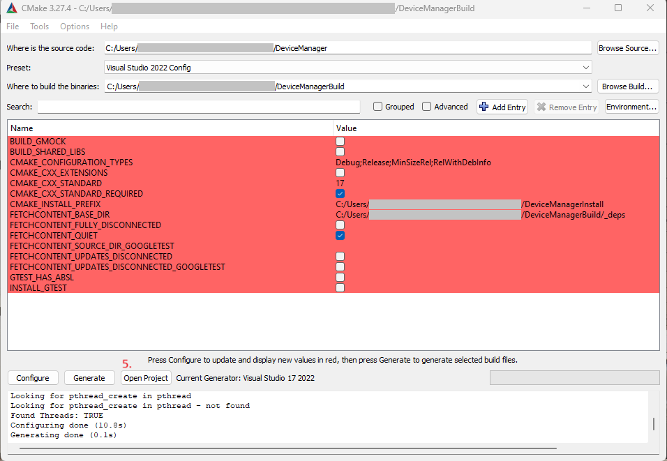

# Device Manager

This document describes the tasks as well as the technical requirements.

# Rules of the Game

No additional external libraries may be added. The C++20 standard with all contents of the standard library may be used. Already included libraries may also be used.

# Task Part 1

Your Job is to extend the program to the customers requirements. The customer now wants to distinguish between two types of devices: analog and digital.

Analog devices should receive ascending IDs between 100 and 9,999. Their description should now be "ADxxxx", where xxxx is the ID with leading zeros.

Digital devices receive ascending IDs between 10,000 and 19,999. Their description should now be "DDxxxxx", where xxxxx is the ID.

# Task Part 2

Digital devices come in three variants: A, B, and D. They still share an ID range. These variants now generate an additional output called "Status".

- Variant A should output a value between -50.0 and +70.0. 
The output should be "Low" if the value equals -50.0 and "High" if the value equals +70.0
- Variant B should output "On" or "Off".
- Variant D comes in two generations. If the ID is >= 15,000, it is considered Gen 2, which extends the description with "(Gen 2)".
  - Generation 1 should output values from 0% to 100% in steps of 10.
  - Generation 2 should output values from 0% to 100% in steps of 1. 
  The output should be "Opened" if the value equals 0% and "Closed" if the value equals 100%

# Project Requirements and Usage

## CMake

The project is based on [CMake](https://cmake.org/), a tool for building, testing, packaging, and installing software. CMake is an open-source software by [Kitware](https://www.kitware.com/) and is available for Windows, Linux, and macOS. At least version 3.30 is required. A general guide to using CMake can be found at: [https://cmake.org/cmake/help/latest/guide/user-interaction/index.html](https://cmake.org/cmake/help/latest/guide/user-interaction/index.html)

### Installation

CMake can be downloaded and installed directly from the [download page](https://cmake.org/download/). Alternatively, packages are available in various package managers.

#### Windows

Installation is possible directly via [winget](https://learn.microsoft.com/en-us/windows/package-manager/winget/). The following command can be executed in [PowerShell](https://learn.microsoft.com/en-us/powershell/scripting/install/installing-powershell-on-windows?view=powershell-7.2):

```winget install -s winget -e --id Kitware.CMake```

#### Linux

##### OpenSUSE Tumbleweed

The latest version of CMake can be installed directly from the package sources.

```sudo zypper in cmake```

or

```sudo zypper in cmake-gui```

if the CMake GUI is to be used.

##### Ubuntu 24.04 Noble

For LTS versions, the version from the package sources is often outdated. Therefore, installation from the Kitware repository is recommended. Instructions for adding the repository can be found at [https://apt.kitware.com/](https://apt.kitware.com/)

## Compiler, Build Tools, and IDEs

The project does not require a specific compiler, build tool, or IDE. The only requirement is that the compiler must support C++20.

### Windows

On Windows, installing [Visual Studio Community](https://visualstudio.microsoft.com/vs/community/) is recommended, as it provides all the necessary tools in one package.

```winget install -s winget -e --id Microsoft.VisualStudio.2022.Community```

Additionally, Ninja and/or Clang/LLVM can be installed as follows:

```
winget install -s winget -e --id Ninja-build.Ninja
winget install -s winget -e --id LLVM.LLVM
```

### Linux

On Linux, either GCC or Clang/LLVM can be used as the compiler. For the build tool, either make or ninja is recommended.

#### OpenSUSE Tumbleweed

All packages can be installed via the official package sources.

```sudo zypper in make ninja gcc-c++ clang llvm```

#### Ubuntu 24.04 Noble

The package *build-essential* contains gcc, g++, and make. If needed, the packages *ninja*, *clang*, and *llvm* can also be installed, with *clang* having dependencies on *llvm*.

```sudo apt install build-essential ninja clang llvm```

## Working with the Project

It is possible to work with CMake via the command line or the CMake GUI. Many IDEs also offer direct support for CMake. The repository defines so-called presets. Presets are preconfigured CMake settings to configure and build the project without having to specify them each time. The preconfigured presets are: *default*, *vs2022*, and *ninja*. *default* does not define a generator and thus uses CMake’s default for the respective platform. *vs2022* and *ninja* use the Visual Studio 2022 generator and the Ninja-Multiconfig generator, respectively. The chosen generator determines which build tool is used for the actual project build. By default, the project is built into the folder *DeviceManagerBuild*, which is located next to the project folder *DeviceManager*. Additionally, the application is installed after the build into the folder *DeviceManagerInstall*, also located at the same level as the project and build folders.

### Using the CMake GUI

The following describes an example of using the CMake GUI for Visual Studio.



After starting the CMake GUI application, a window opens where the path to the source folder containing the DeviceManager sources must be set (CMake GUI 1: 1.).
Now, a preset can be selected (CMake GUI 1: 2.), and the project can be configured using the *Configure* button (CMake GUI 1: 3.).
The build folder is automatically determined from the presets and is located on the same level as the source folder.



Next, a prompt appears to create the build folder, which can be confirmed (CMake GUI 2).



The following window with additional settings for the generator can also be confirmed without changes (CMake GUI 3).



After successful configuration, the build files can be generated using the *Generate* button (CMake GUI 4: 4.).



If the generator creates projects for a specific IDE, such as the Visual Studio generator, the IDE can be opened directly from the CMake GUI (CMake GUI 5: 5.).

### Using the Command Line

The repository also includes a script named *device_manager.py*, which provides an example of how to work with the project via the command line. The script can also be used directly to build, test, and run the project.

The script accepts two arguments: *preset* (p) and *fresh* (f).
The *preset* argument allows selecting one of the presets described above.
The *fresh* flag ensures a complete CMake reconfiguration.
However, when switching generators, an error may occur stating that the generator does not match the one in the CMakeCache.
In this case, the build folder (or at least the CMake cache) must be deleted.

For example, a script call on Windows might look like this:

```py .\DeviceManager\device_manager.py -p ninja -f```

This executes a CMake call for a fresh configuration using the Ninja-Multiconfig generator.

### Adding Source Files

In general, the *CMakeLists.txt* files do not need to be modified for completing the task.
However, if a new file is added to the project, it must be registered with CMake so that it is considered during the build process.
To do this, the path to the new file must be specified in the corresponding *CMakeLists.txt* file in the *target_sources* command.
For example, when adding the file *DeviceManager/DeviceManager/src/MyNewFile.cpp* to *DeviceManager/DeviceManager/CMakeLists.txt*, the following change should be made:

Before:
```
target_sources(DeviceManager
    PRIVATE
        src/DeviceManager.cpp
)
```

After:
```
target_sources(DeviceManager
    PRIVATE
        src/DeviceManager.cpp
        src/MyNewFile.cpp
)
```

